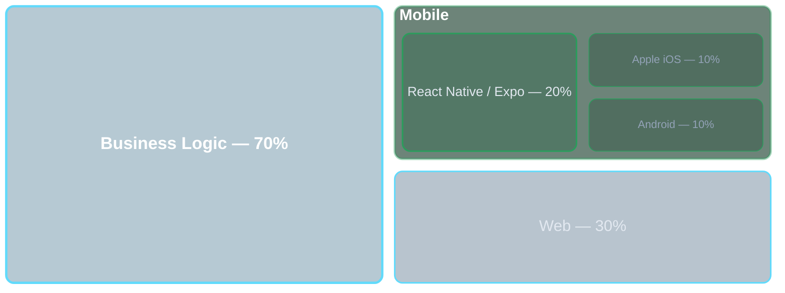

# Stack tecnologico
---

# React Native & Expo

 

- **React Native**: 
    - framework open source di Meta 
    - usa JavaScript/TypeScript e React 
    - una sola codebase per iOS e Android
    - UI e performance native.

- **Expo**: piattaforma e toolchain che semplifica lo sviluppo React Native. 

---

# Codice condiviso frontend-mobile

---

# Gestione delle applicazioni negli store 

 

- Processo di rilascio più snello e automatizzato
- Pubblicazione sugli store più semplice
- Possibilità di aggiornamenti OTA (Over The Air), bypassando in alcuni casi l'approvazione di Apple/Google
- Una sola pipeline di rilascio per entrambe le piattaforme
---

# Perché ora?

### 2019

- La gestione delle videochiamate su React Native era più complessa
- Il bridge JS/native era un collo di bottiglia

### Oggi

- **New Architecture** stabile, bridge rimosso
- **Expo EAS** affidabile in produzione
- La nostra logica web è matura e pronta da portare

---

# Rischi

- Alcune API native non hanno wrapper pronti, servono moduli custom
- La New Architecture è stabile ma giovane

- React Native è estendibile con codice nativo
- In caso di mancato aggiornamento, feature leggermente più lente

