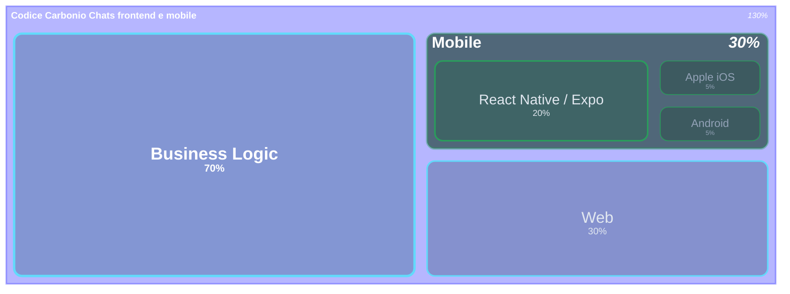

# React Native & Expo
---

# React Native & Expo

 

- **React Native**: framework open source di Meta per creare app mobile native usando JavaScript/TypeScript e React. Permette di scrivere una sola codebase per iOS e Android, con UI e performance native.

- **Expo**: piattaforma e toolchain che semplifica lo sviluppo React Native. Offre strumenti, librerie, build cloud e aggiornamenti OTA, rendendo più facile e veloce creare, testare e distribuire app mobile.

---

# Codice condiviso

---

# Upgrade degli SDK

React Native ed Expo semplificano sia l’upgrade degli SDK che la pubblicazione negli store:

- Upgrade SDK: Expo offre comandi e documentazione per aggiornare facilmente l’SDK, con tool che automatizzano gran parte del processo. React Native ha una community attiva e strumenti come “react-native upgrade”.
- Pubblicazione negli store: Expo fornisce build cloud, generazione automatica di pacchetti (APK/IPA) e procedure guidate per la pubblicazione su App Store e Google Play, riducendo errori e complessità.
- con Expo è possibile fare un “hot upgrade” tramite gli aggiornamenti OTA (Over The Air). E' possibile distribuire nuove versioni del codice JavaScript/TypeScript (fix, feature, UI) direttamente sui dispositivi degli utenti, senza dover ripubblicare l’app negli store

---

# Perché Ora?

### Al tempo

- WebRTC su React Native era un incubo
- Il bridge JS/native era un collo di bottiglia
- I team erano separati, non c'era contesto condiviso

### Oggi

- **New Architecture** stabile, bridge rimosso
- **Expo EAS** affidabile in produzione
- La nostra logica web è matura e pronta da portare

---

# Rischi

- Alcune API native non hanno wrapper pronti, servono moduli custom
- La New Architecture è stabile ma giovane
- Performance leggermente inferiori in casi molto specifici (grafica, animazioni complesse)

- React Native è estendibile con codice nativo
- In caso di mancato aggiornamento, feature leggermente più lente
- Solo per applicazioni molto spinte graficamente (giochi o rendering)

