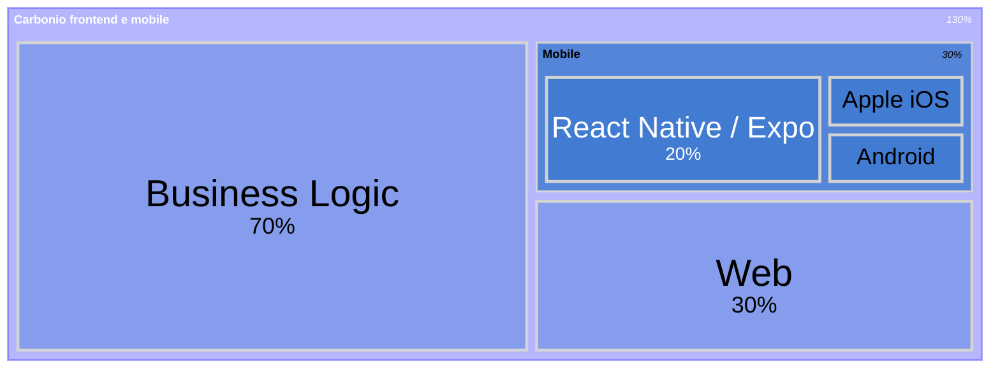

# React Native & Expo

---

# React Native & Expo

 

- **React Native**: framework open source di Meta per creare app mobile native usando JavaScript/TypeScript e React. Permette di scrivere una sola codebase per iOS e Android, con UI e performance native.

- **Expo**: piattaforma e toolchain che semplifica lo sviluppo React Native. Offre strumenti, librerie, build cloud e aggiornamenti OTA, rendendo più facile e veloce creare, testare e distribuire app mobile.

<!--
Voglio essere chiara su un punto: React Native non è "il meno peggio". Per il nostro contesto specifico, è la scelta migliore. Stesso linguaggio — TypeScript e React — significa che chiunque nel team può contribuire al mobile dal giorno uno, senza formazione aggiuntiva. Il codice condiviso non è un'aspirazione: è realtà. Gli store Zustand, la logica di normalizzazione dei messaggi, le utility — le abbiamo già portate e funzionano. React Native compila in componenti nativi veri, non è una WebView mascherata. E se mai dovessimo fare qualcosa che React Native non offre di suo — per esempio un'integrazione molto specifica con il sistema operativo — possiamo sempre scrivere un modulo nativo in Swift o Kotlin. Non siamo mai bloccati.
-->

---

# Codice condiviso

---

# Upgrade degli SDK

React Native ed Expo semplificano sia l’upgrade degli SDK che la pubblicazione negli store:

- Upgrade SDK: Expo offre comandi e documentazione per aggiornare facilmente l’SDK, con tool che automatizzano gran parte del processo. React Native ha una community attiva e strumenti come “react-native upgrade”.
- Pubblicazione negli store: Expo fornisce build cloud, generazione automatica di pacchetti (APK/IPA) e procedure guidate per la pubblicazione su App Store e Google Play, riducendo errori e complessità.
- con Expo è possibile fare un “hot upgrade” tramite gli aggiornamenti OTA (Over The Air). E' possibile distribuire nuove versioni del codice JavaScript/TypeScript (fix, feature, UI) direttamente sui dispositivi degli utenti, senza dover ripubblicare l’app negli store

---

# Perché Ora?

### Al tempo

- WebRTC su React Native era un incubo
- Il bridge JS/native era un collo di bottiglia
- I team erano separati, non c'era contesto condiviso

### Oggi

- **New Architecture** stabile, bridge rimosso
- **Expo EAS** affidabile in produzione
- La nostra logica web è matura e pronta da portare

<!--
Un'altra domanda legittima: "Se React Native è così bello, perché non l'avete fatto prima?" La risposta è semplice: prima non era pronto. Quando abbiamo iniziato la verticalizzazione due anni fa, React Native aveva ancora il vecchio bridge JavaScript che era un collo di bottiglia per le performance. WebRTC su React Native era un incubo. Expo non supportava ancora build in produzione in modo affidabile. Oggi è tutto cambiato. La New Architecture è stabile e rimuove il bridge. Expo con EAS ci dà build cloud, deploy automatizzati, aggiornamenti OTA. E nel frattempo la nostra logica web si è consolidata: gli store, i modelli, le API — tutto maturo e pronto per essere portato su mobile. Il timing è perfetto: la tecnologia è pronta e noi siamo pronti.
-->

---

# Rischi

- Alcune API native non hanno wrapper pronti, servono moduli custom
- La New Architecture è stabile ma giovane
- Performance leggermente inferiori in casi molto specifici (grafica, animazioni complesse)

- React Native è estendibile con codice nativo
- In caso di mancato aggiornamento, feature leggermente più lente
- Solo per applicazioni molto spinte graficamente (giochi o rendering)

<!--
Questa è la slide dell'onestà, e ci tengo. Non voglio fare solo propaganda. I pro li abbiamo visti e sono solidi: stack condiviso, riutilizzo reale del codice, performance native, aggiornamenti OTA. Ma ci sono anche dei contro e dei rischi che stiamo gestendo. Alcune API native — per esempio la gestione avanzata dell'audio Bluetooth — non hanno wrapper React Native pronti e dobbiamo scrivere moduli custom. Il debug su un dispositivo fisico è oggettivamente più complesso che aprire i DevTools del browser: ci sono più variabili, più cose che possono andare storte. E la New Architecture di React Native è stabile, sì, ma è giovane — la community la sta ancora adottando e non tutti i pacchetti di terze parti sono aggiornati. Detto questo, il bilancio per il nostro caso d'uso è nettamente positivo. I rischi sono gestibili e li stiamo gestendo.
-->
